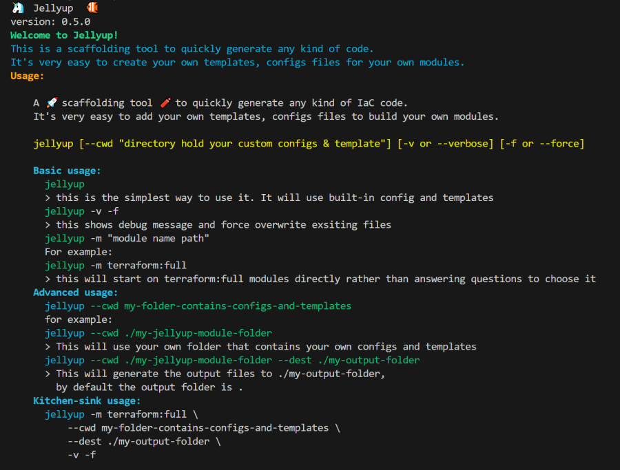

# 🦄 Jellyup  🐠

A simple scaffolding IaC code generator tool

## Installation
```
npm install -g jellyup
```

## Features and Purpose

This tool uses a popular nodejs based scaffolding tool called [plop](https://github.com/plopjs/plop)

It's similar to the other popular code generation tools like create-react-apps and create-backstage-app etc which also use plop library.  
The advantages of plop over tools like cookiecutter in Python is plop gives full programing capabilities to write your own logic to generate files.

The template can be [hbs (handle-bars)](https://github.com/handlebars-lang/handlebars.js) based or plain files.  

Here are some basic terms and logics in its templates:

* **configs** This are the generators users can choose to generate code
* **templates** This is the folder where all templates are located
* **generators** These are the "tools" to generate code.  
for example, I can have a "terraform:init" generator to generate a config file for user to fill out  
then they can choose a "terraform:vpc" generator to generate files to create a VPC
* **actions** Each generator can have multiple 'actions',  
examples are like `add` which is to generate one file from one template  
or `addMany` which is to generate multiple files from groups of files.   
There are many types of actions and you can even create your own `actions`.  
Refere to [plop actions reference](https://plopjs.com/documentation/#built-in-actions) for details.


## Usage



## Key notes

* `--cwd`:  This tells where to find the `configs` and `templates`, if you don't provide, the tool will ask for
* `--dest`: This is to specify where the generated code will be put, default is "."  
If you don't provide, it will ask too.
* `-v or --verbose`: When this flag is set, it will print all the debug messages
* `-f or --force`: By default if the detination files already exist, it will skip  
using `-f` flag will force it to overwrite existing files

## How are the template files organized

The sample-templates show some templates and configs samples  
Those `generators` javascript files are in the configs folder  
The tool will traverse the folder and ask you to select  
Here is an example
```
🦄  Jellyup  🐠
version: 0.5.0
Welcome to Jellyup!
This is a scaffolding tool to quickly generate any kind of code.
It's very easy to create your own templates, configs files for your own modules.
? Please input the path which contains the configs and templates:  ./sample-templates
? Please provide the folder that will hold generated files:  /tmp/test
? Choose one option:  serverless
? Choose one option:  full
? [PLOP] Please choose a generator. (Use arrow keys)
❯ serverless:init - generate config.yaml in current folder 
  serverless:scaffold-runway - create scaffold folders including runway.yml 
```

I choose `serverless:init` and the following code in `sample-templates/config/serverless/full/runway-scaffold.js` will get run

```
    plop.setGenerator('serverless:init', {
        description: 'generate config.yaml in current folder',
        prompts: [{
            type: 'input',
            name: 'name',
            message: 'project name please'
        }],
        actions: [{
            type: 'add',
            path:  '.jellyup/config.yaml',
            templateFile: `${cfgDir}/templates/serverless/config.yaml.hbs`
        }]
    });

```
This will use the `templates/serverless/config.yaml.hbs` file to generate a `.jellyup/config.yaml` file in my destination folder `/tmp/test`.

I will update the file with my updated configs, rerun the tool and choose the other generator like `serverless:scaffold-runway`

The code in [sample-templates/config/serverless/full/runway-scaffold.js](sample-templates/config/serverless/full/runway-scaffold.js) will use load all the configs in ".jellyup" folder including the config.yaml file as config `data` to pass to the hbs templates like these

```
    plop.setGenerator('serverless:scaffold-runway', {
        description: 'create scaffold folders including runway.yml',
        prompts: [],
        actions: function(data) {
            if(!config.configFileLoaded){
                console.log("ERROR: looks like you haven't run init to generate the config.yaml file");
                console.log("Please run init and modify the config.yaml first.");
                return false;
            }
            var actions = [];
            data = Object.assign({}, data, config.data);
            // console.log(config.data);
            // console.log(data);

            actions.push({
                type: 'add',
                path: 'runway.yml',
                data: data,
                templateFile: `${cfgDir}/templates/serverless/scaffold-runway/runway.yml.hbs`
            });
        ...
```

You can create your own configs and templates and follow the same pattern (generate config file, update, then generate final code) to scaffold and generate any code repos.

Happy coding 